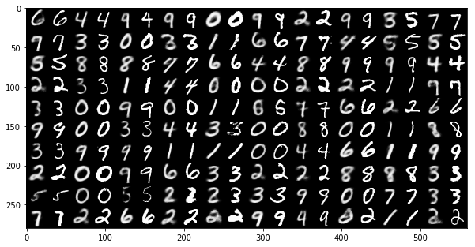
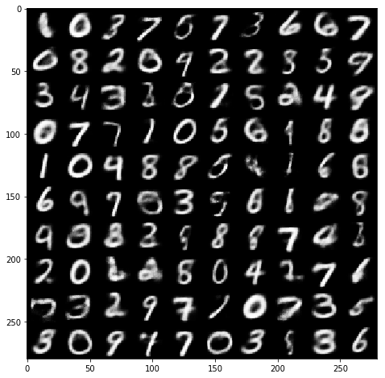
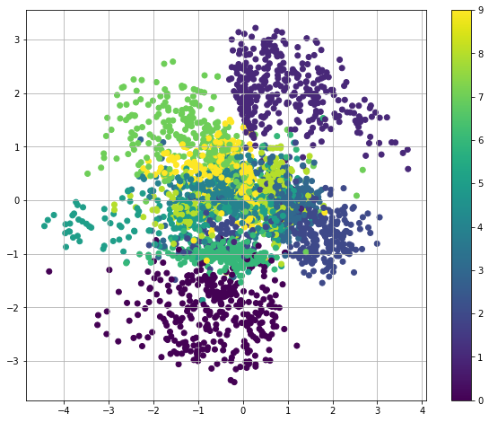
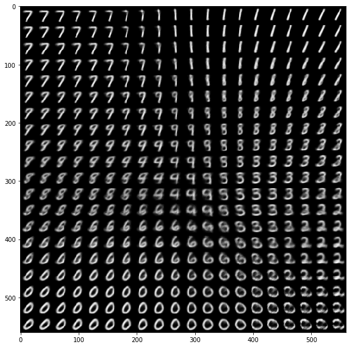

# Variational Autoencoder in Tensorflow

This is an [Tensorflow](https://www.tensorflow.org/) implementation of a variational autoencoder for the deep learning course at USC ([CSCI-599 Deep Learning and its Applications](https://csci599-dl.github.io/)) taught by [Professor Joseph Lim](http://www-bcf.usc.edu/~limjj/). The slides of this lecture are available [here](#). This demo code is written by [Shao-Hua Sun](http://shaohua0116.github.io).

## Results

### Reconstruction

    

    

### Generation

    

    

### Transformation

    

    

### Latent space

    

    

## Related works

### VAE
* The original VAE paper: [Auto-Encoding Variational Bayes](https://arxiv.org/abs/1312.6114)
* [Variational Autoencoder: Intuition and Implementation](https://wiseodd.github.io/techblog/2016/12/10/variational-autoencoder/)
* [Generating Large Images from Latent Vectors](http://blog.otoro.net/2016/04/01/generating-large-images-from-latent-vectors/)
* This demo code is partially based on the code from this post [Variational Autoencoder in TensorFlow](https://jmetzen.github.io/2015-11-27/vae.html)

### Generative models
* My implementation of [Semi-supervised learning GAN](https://github.com/gitlimlab/SSGAN-Tensorflow)
* My implementation of [Deep Convolutional GAN](https://github.com/shaohua0116/DCGAN-Tensorflow)
* My implementation of [Generative Latent Optimization](https://github.com/gitlimlab/Generative-Latent-Optimization-Tensorflow)

## Author

Shao-Hua Sun / [@shaohua0116](https://github.com/shaohua0116/) @ [Joseph Lim's research lab](https://github.com/gitlimlab) @ USC
